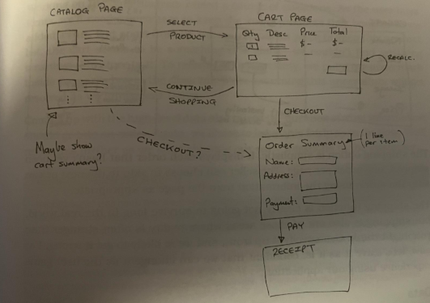
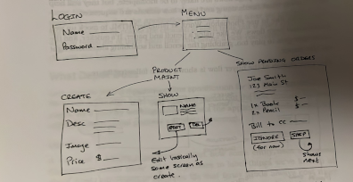
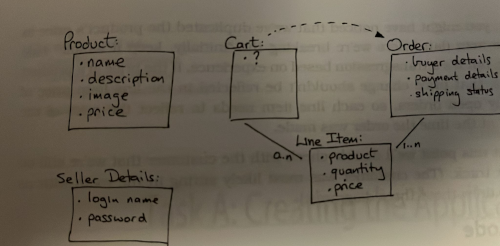

## The Depot Application

A comprehensive, coherent and concise overview of the Ruby on Rails framework.  It creates a realistic, real-world application from scratch using the latest technologies.

From Sam Ruby's "Agile Web Development with Rails7" book.


- Lets create a web-based shopping cart application called Depot
- This app will illustrate many of the features of Rails development
	- create maintenance pages[[
	- link database tables
	- handle sessions
	- create forms
	- wrangle modern Javascript
	- unit and system testing
	- security
	- page layout

- we'll develop the app incrementally
- system that does not penalise us for changing our minds
- Rails will provide a set of tests with each controller

#### What Depot Does

- sketch out the high level use cases and page flow
- use case = statement about how an entity uses the system
- Two initial roles = the Buyer and the Seller
- Buyer uses Depot to browse what we have to sell, select some product(s) to purchase and supplies the information needed to create an order
- Seller uses Depot to maintain a list of products to sell, to determine the orders that are awaiting shipment and to mark orders as shipped

#### Page Flow

- get an idea of main pages and understand roughly how users navigate among them
- buyer sees a catalog from which they select one product at a time
- each selected product gets added to the cart
	- cart is displayed after each selection
- buyer can continue shopping using the catalog or check out to buy the contents of the cart
- during checkout we capture the contact and payment details and then display a receipt page (handling payment is vague at this point!)

**Rough sketch of Buyer Page Flow**


Seller logs in
- seller sees a menu letting them create or view a product or ship existing orders
- when viewing a product the seller can edit or delete the product

**Rough sketch of Seller Page Flow**


Data
- we need to think about the data that we're going to be working with
- lets sketch the use cases and page flows
- `?` represents the idea that we need somewhere (other than the transient cart) to store the list of products that the user bought - we'll resolve this as we go!!

**Rough sketch of Data Flow**


### Task A : Creating the Application

#### A1 : Creating the Product Maintenance Application
- database will be at the heart of the app
	- installed, configured and tested early
- we'll use TailwindCSS
	- add this as an additional option in the setup

### Task A : Creating the Application

#### A1 : Creating the Product Maintenance Application
- database will be at the heart of the app
	- installed, configured and tested early
- we'll use TailwindCSS
	- add this as an additional option in the setup

```
rails new depot --css tailwind
```

```
cd depot
```


- we'll be using SQLite version 3 as the database
	- default and installed with Rails
	- convention over configuration
	- no special user accounts or passwords to deal with

#### Generate the Scaffold

Products
- database table and Rails model (to interact with the table)
- a number of views to make up the user interface
- a controller to orchestrate the application
- can create all of the above in one Rails command

```
rails g scaffold Product title:string description:text image_url:string price:decimal
```


- Note: string is implied if no data type is specified, so we could have left it out here
- the generator creates a bunch of files
- the migration file
	- UTC-based timestamp prefix
	- a name (`create_products`)
	- file extension (`.rb` as its ruby code)
	- represents change to database as a whole or to data in database
	- found in `db/migrate` folder
	- we need to get Rails to apply this migration

```
rails db:migrate
```


- rails looks for ALL the migration snot yet applied and applies them
- `products` table is added to database as defined by the `development` section of the `database.yml` file

- with 3 commands, we've setup our application
- lets start the server and take a look

```
bin/dev
```


- show server starting and CSS rebuilding (as per `Procfile.dev`)
	- you may need to modify if you're using a virtual machine
- we can go to `http://localhost:3000/products`
- click on `New Product` link and we see a form that will allow us to add a new product
- we can modify this form by going to `/views/products/_form.html.erb` if we want
- fill in the form and click `Create`
- going back we should see the new product in the list
- it's rough but it's not bad for 3 steps

```
bin/rails test
```


- we should see `0 failures, 0 errors`
- minimal testing at this point
- generated along with the scaffold for the controller and model

#### A2 : Making Prettier Listings

- customer request : product listings are ugly - can we make them prettier and add an image of the product too
- lets generate a consistent set of data to work with by seeding the database
- first lets modify the `seeds.rb` file in the `db` directory
	- warning: this file removes existing data before loading new data - you might not want to run it if you've spent hours adding your own data!!
	
**db/seeds.rb**
```rb
Product.delete_all
Product.create!(title: 'Docker for Rails Developers',
  description:
    %{<p>
      <em>Build, Ship, and Run Your Applications Everywhere</em> Docker does
      for DevOps what Rails did for web development—it gives you a new set
      of superpowers. Gone are “works on my machine” woes and lengthy setup
      tasks, replaced instead by a simple, consistent, Docker-based
      development environment that will have your team up and running in
      seconds.  Gain hands-on, real-world experience with a tool that’s
      rapidly becoming fundamental to software development. Go from zero all
      the way to production as Docker transforms the massive leap of
      deploying your app in the cloud into a baby step.
      </p>},
  image_url: 'ridocker.jpg',
  price: 19.95)
# . . .
Product.create!(title: 'Design and Build Great Web APIs',
  description:
    %{<p>
      <em>Robust, Reliable, and Resilient</em>
      APIs are transforming the business world at an increasing pace. Gain
      the essential skills needed to quickly design, build, and deploy
      quality web APIs that are robust, reliable, and resilient. Go from
      initial design through prototyping and implementation to deployment of
      mission-critical APIs for your organization. Test, secure, and deploy
      your API with confidence and avoid the “release into production”
      panic. Tackle just about any API challenge with more than a dozen
      open-source utilities and common programming patterns you can apply
      right away.
      </p>},
  image_url: 'maapis.jpg',
  price: 24.95)
# . . .

Product.create!(title: 'Modern CSS with Tailwind',
  description:
    %{<p>
      <em>Flexible Styling Without the Fuss</em>
      Tailwind CSS is an exciting new CSS framework that allows you to
      design your site by composing simple utility classes to create complex
      effects. With Tailwind, you can style your text, move your items on
      the page, design complex page layouts, and adapt your design for
      devices from a phone to a wide-screen monitor. With this book, you’ll
      learn how to use the Tailwind for its flexibility and its consistency,
      from the smallest detail of your typography to the entire design of
      your site.
      </p>},
  image_url: 'tailwind.jpg',
  price: 18.95)

  User.create! name: 'dave',
        password: Rails.application.credentials.dave_password
```

- to populate the your `products` table with test data ..

```
rails db:seed
```

- replace the code in `index.html.erb` in `app/views/products` with our own Tailwind inspired table-based template ...

```html
<div class="w-full">
  <% if notice.present? %>
  <p
    class="inline-block px-3 py-2 mb-5 font-medium text-green-500 rounded-lg bg-green-50"
    id="notice"
  >
    <%= notice %>
  </p>
  <% end %>

  <div class="flex items-center justify-between pb-8">
    <h1 class="mx-auto text-xl font-bold">Products</h1>
    <%= link_to 'New product', new_product_path, class: "rounded-lg py-3 px-5
    bg-blue-600 text-white block font-medium" %>
  </div>

  <table id="products" class="mx-auto">
    <tfoot>
      <tr>
        <td colspan="3">
          <div class="mt-8">
            <%= link_to 'New Product', new_product_path, class: "inline
            rounded-lg py-3 px-5 bg-green-600 text-white block font-medium" %>
          </div>
        </td>
      </tr>
    </tfoot>
    <tbody>
      <% @products.each do |product| %>
      <tr class="<%= cycle('bg-purple-50', 'bg-white') %>">
        <td class="px-2 py-3">
          <%= image_tag(product.image_url, class: 'w-40') %>
        </td>
        <td>
          <h1 class="mb-3 text-xl font-bold"><%= product.title %></h1>
          <p><%= truncate(strip_tags(product.description), length: 80) %></p>
        </td>
        <td class="px-3">
          <ul>
            <li><%= link_to 'Show', product, class: 'hover:underline' %></li>
            <li>
              <%= link_to 'Edit', edit_product_path(product), class:
              'hover:underline' %>
            </li>
            <li>
              <%= link_to 'Destroy', product, class: 'hover:underline', data: {
              turbo_method: :delete, turbo_confirm: "Are you sure?" } %>
            </li>
          </ul>
        </td>
      </tr>
      <% end %>
    </tbody>
  </table>
</div>

```


- the template uses a number of built-in Rails features
	- helper method `cycle()` sets the class of each alternating row to different background colors - green and white
	- helper method `truncate()` - description shows only first 80 characters
	- `strip_tags()` - removes the HTML tags


### Future Sections

Task B : Validation and Unit Testing

Task C : Catalog Display

Task D : Cart Creation

Task E : A Smarter Cart

Task F : Hotwiring the Storefront

Task G : Check Out!

Task H : Sending Emails and Processing Payments Effeciently

Task I : Logging In

Task J : Internationalisation

Task K : Receive Emails and Respond with Rich Text

Task L : Deployment and Production

Depot Retrospective and Documenting What We've Done